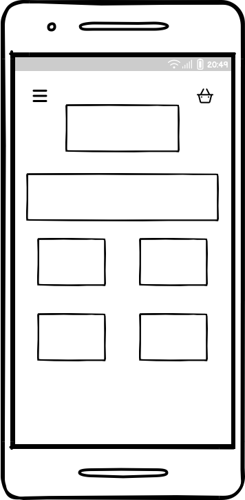
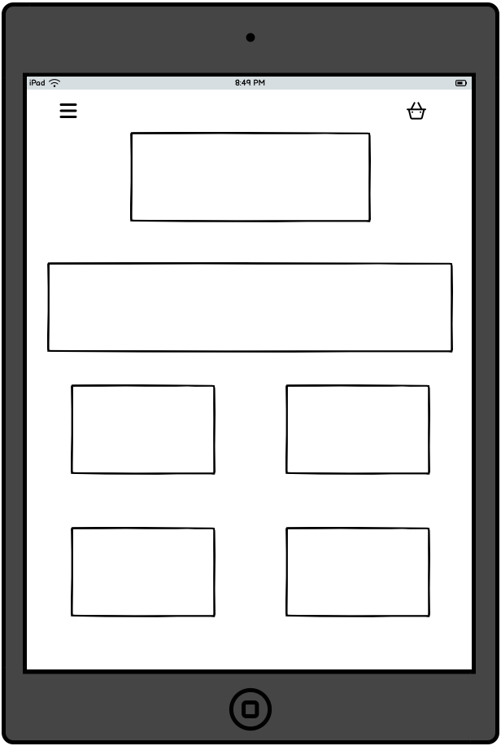

# Guerrier Clothing: A streetwear brand - Wear Your Strength  
Welcome to **Guerrier**, a bold streetwear brand inspired by the spirit of warriors. Based in the vibrant streets of Dublin, Guerrier draws its name from the French word for *warrior*, representing strength, courage, and resilience.  

Our mission is simple: to create clothing that empowers you to take on life’s challenges with confidence. Designed with a blend of cutting-edge streetwear aesthetics and premium-quality craftsmanship, Guerrier is your go-to armor for standing out and standing strong.  

* [Link to App](https://guerrier-184e74af35e6.herokuapp.com/) 
  

 

### Home Page Wireframes

# Technologies

## Languages Used
* [HTML5](https://en.wikipedia.org/wiki/HTML5)
* [CSS3](https://en.wikipedia.org/wiki/Cascading_Style_Sheets)
* [Javascript](https://en.wikipedia.org/wiki/JavaScript)
* [Python](https://en.wikipedia.org/wiki/Python_(programming_language))

## Frameworks Used

* [Django](https://www.djangoproject.com/)
* [Bootstrap](https://blog.getbootstrap.com/) 

## Libraries And Installed Packages

* [crispy-bootstrap4](https://pypi.org/project/crispy-bootstrap4/) - Template pack used for django-crispy-forms
* [django-crispy-forms](https://pypi.org/project/crispy-bootstrap4/) - Used to render forms throughout the project.
* [dj-database-url](https://pypi.org/project/dj-database-url/) - A package used to utilize DATABASE_URL environment variable.  
* [django-allauth](https://django-allauth.readthedocs.io/en/latest/) - Allows authentication, registration and account management in Django.
* [django-countries, v7.2.1](https://pypi.org/project/django-countries/7.2.1/) - Django application used to provide country choices for use with forms, and a country field for models.
* [gunicorn](https://gunicorn.org/) - A Python WSGI HTTP Server for UNIX.
* [psycopg2](https://pypi.org/project/psycopg2/) - A PostgreSQL database adapter.
* [django storages](https://django-storages.readthedocs.io/en/latest/) - Collection of custom storage backends for Django.
* [stripe==7.8.1](https://pypi.org/project/stripe/) - A Python library for Stripe’s API.
* [django-summernote](https://github.com/summernote/django-summernote) - Is a simple WYSIWYG editor.

## Tools And Resources

* [GitPod](https://www.gitpod.io/) - Used as a coding environment.
* [GitHub](https://github.com/) - Used for creating application repository, version control, organising workflow utilising agile functionality of GitHub project, issues and milestones.
* [Heroku](https://heroku.com) - Used to deploy live project.
* [AmIResponsive](https://ui.dev/amiresponsive) - Used for obtaining screenshot of the application on various devices.
* [PostgreSQL CI Database](https://dbs.ci-dbs.net/) - Used to create a database
* [JSHint](https://jshint.com/) - Used to validate JavaScript.
* [W3C Markup Validation Service](https://validator.w3.org/) - Used to validate HTML.
* [CSS Validation Service](https://jigsaw.w3.org/css-validator/) - Used to validate CSS.
* [CI Python Linter](https://pep8ci.herokuapp.com/#) - Used to validate Python.

# Credits
## Listed below are sources of information which helped me in the making of this project
- [Boutique Ado Walkthrough Project](https://learn.codeinstitute.net/courses/course-v1:CodeInstitute+EA101+2021_T1/courseware/eb05f06e62c64ac89823cc956fcd8191/3adff2bf4a78469db72c5330b1afa836/)
- [I Think Therefore I Blog Walkthrough Project](https://learn.codeinstitute.net/courses/course-v1:CodeInstitute+FSD101_WTS+2023_Q3/courseware/56a2da0940b4411d8a38c2b093a22c60/4565659a34d648b8b8edd063c3182180/)
- [Performance Footwear](https://github.com/Marchopkins96/Performance-Footwear/tree/main)

### Deployment 

The live deployed application can be found deployed on [Heroku] (https://guerrier-184e74af35e6.herokuapp.com/)

### Heroku Deployment

This project uses [Heroku](https://www.heroku.com), a platform as a service (PaaS) that enables developers to build, run, and operate applications entirely in the cloud.

#### Cloning

You can clone the repository by following these steps:

1. Go to the [GitHub repository](https://github.com/micdr93/Guerrier-Clothing)
2. Locate the Code button above the list of files and click it
3. Select if you prefer to clone using HTTPS, SSH, or GitHub CLI and click the copy button to copy the URL to your clipboard
4. Open Git Bash or Terminal
5. Change the current working directory to the one where you want the cloned directory
6. In your IDE Terminal, type the following command to clone the repository:
    - `git clone https://github.com/micdr93/Guerrier-Clothing.git`
7. Press Enter to create your local clone.

#### Forking

By forking the GitHub Repository, we make a copy of the original repository on our GitHub account to view and/or make changes without affecting the original owner's repository.  
You can fork this repository by using the following steps:

1. Log in to GitHub and locate the [GitHub Repository](https://github.com/micdr93/Guerrier-Clothing)
2. At the top of the Repository (not top of page), just above the "Settings" Button on the menu, locate the "Fork" Button.
3. Once clicked, you should now have a copy of the original repository in your own GitHub account!

# Acknowledgements 

* I would like to thank my Mentor, Daniel Hmailton for his help and guidance so far on all projects
* I would also like to express my thanks to the Code Institute tutors who have supported me so far.