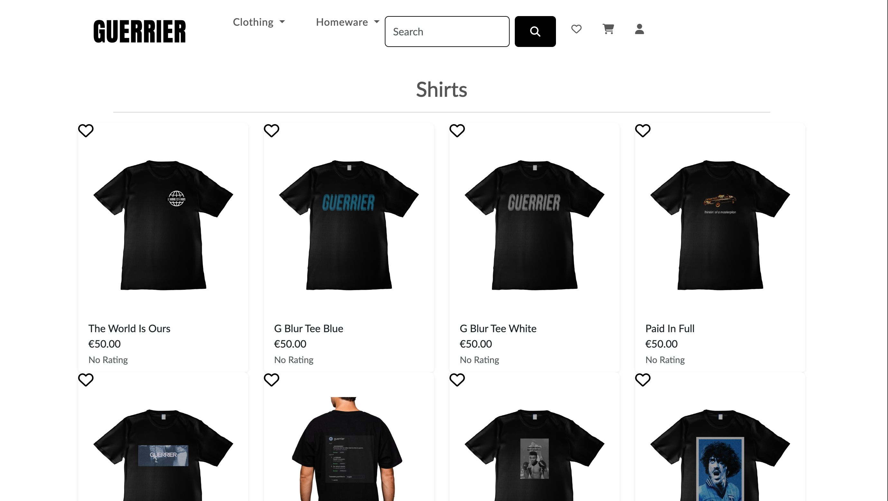

# Guerrier Clothing: A streetwear brand - Wear Your Strength  
Welcome to **Guerrier**, a bold streetwear brand inspired by the spirit of warriors. Based in the vibrant streets of Dublin, Guerrier draws its name from the French word for *warrior*, representing strength, courage, and resilience.  

Our mission is simple: to create clothing that empowers you to take on life’s challenges with confidence. Designed with a blend of cutting-edge streetwear aesthetics and premium-quality craftsmanship, Guerrier is your go-to armor for standing out and standing strong.  

* [Link to App](https://guerrier-184e74af35e6.herokuapp.com/) 
  

---

## Table of Contents

1. [UX](#ux)
2. [Strategy](#strategy)
   * [Target Users](#target-users)
   * [Site Goals](#site-goals)
   * [Project Goals](#project-goals)
3. [Agile Planning](#agile-planning)
   * [User Stories](#user-stories)
4. [Structure](#structure)
   * [Wireframes](#wireframes)
   * [Database Schema](#database-schema)
5. [Main Plan](#main-plan)
6. [Features](#features)
   * [Existing Features](#existing-features)
   * [Future Features](#future-features)
7. [Design](#design)
   * [Colour Scheme](#colour-scheme)
   * [Typography](#typography)
   * [Site Images](#site-images)
8. [Business Model](#business-model)
   * [Marketing Strategy](#marketing-strategy)
   * [SEO](#seo)
9. [Technologies](#technologies)
   * [Languages Used](#languages-used)
   * [Frameworks and Libraries](#frameworks-and-libraries)
   * [Tools and Resources](#tools-and-resources)
10. [Testing](#testing)
11. [Bugs](#bugs)
12. [Credits](#credits)
13. [Deployment](#deployment)
14. [Acknowledgements](#acknowledgements)

 

## UX

### Strategy

#### Target Users

- Fashion-conscious individuals aged 18-35
- Streetwear enthusiasts looking for unique designs
- Customers who value quality and brand story
- People who identify with the warrior mentality and resilience theme

#### Site Goals

- Create an intuitive shopping experience that showcases the Guerrier brand identity
- Allow users to easily browse, select, and purchase products
- Build brand loyalty through user accounts, wishlists, and reviews
- Provide secure checkout and payment processing
- Enable customers to contact the business with questions or feedback

#### Project Goals

- Develop a full-featured e-commerce platform using Django
- Implement responsive design for all device types
- Create a secure authentication system with user profiles
- Build a robust product management system for administrators
- Integrate Stripe for secure payment processing
- Implement SEO best practices for improved visibility

## Agile Planning

This project was developed using agile methodologies, breaking down the project into smaller tasks through user stories and tracking progress on GitHub Projects. 

### User Stories

#### First-Time Visitor Goals
- As a first-time visitor, I want to easily understand the brand's purpose and values
- As a first-time visitor, I want to browse products intuitively by category
- As a first-time visitor, I want to view product details and images clearly

#### Returning Visitor Goals
- As a returning visitor, I want to create an account to save my information
- As a returning visitor, I want to add items to my wishlist for future purchase
- As a returning visitor, I want to see my order history

#### Site Owner Goals
- As a site owner, I want to manage products through an admin interface
- As a site owner, I want to receive order notifications
- As a site owner, I want to promote special offers and new products

[Link to GitHub Projects Board](https://github.com/users/micdr93/projects/5)

# Structure

### Wireframes

I created detailed wireframes for both desktop and mobile versions of all main pages to guide the development process.

#### Desktop Wireframes

- [Home Page](documentation/wireframes/wireframe-home-page-desktop.png)
- [All Products Page](documentation/wireframes/wireframe-all-products-page-desktop.png)
- [Product Detail Page](documentation/wireframes/wireframe-product-detail-desktop.png)
- [Basket Page](documentation/wireframes/wireframe-basket-page-desktop.png)
- [Checkout Page](documentation/wireframes/wireframe-checkout-page-desktop.png)
- [Wishlist Page](documentation/wireframes/wireframe-wishlist-desktop.png)
- [Reviews Page](documentation/wireframes/wireframe-reviews-desktop.png)
- [Contact Us Page](documentation/wireframes/wireframe-contact-us-desktop.png)

#### Mobile Wireframes

- [Home Page](documentation/wireframes/wireframe-home-page-mobile.png)
- [All Products Page](documentation/wireframes/wireframe-all-products-page-mobile.png)
- [Product Detail Page](documentation/wireframes/wireframe-product-detail-mobile.png)
- [Basket Page](documentation/wireframes/wireframe-basket-page-mobile.png)
- [Checkout Page](documentation/wireframes/wireframe-checkout-page-mobile.png)
- [Wishlist Page](documentation/wireframes/wireframe-wishlist-mobile.png)
- [Reviews Page](documentation/wireframes/wireframe-reviews-mobile.png)
- [Contact Us Page](documentation/wireframes/wireframe-contact-us-mobile.png)

All wireframes were created using Balsamiq to establish a consistent user interface across the site while ensuring responsive design for different devices.

### Database Schema

The project uses a relational database model with the following main models:

- **User**: Extended Django User model with additional profile information
- **Product**: Contains all product information including category, price, and images
- **Category**: Classification system for products
- **Order**: Contains customer and shipping information
- **OrderLineItem**: Individual items within orders
- **Wishlist**: User-saved favorite products
- **Review**: User feedback on products

[Database Schema](documentation/db-schema.png)

## Features

### Existing Features

#### Navigation
- Responsive navigation bar that adapts to different screen sizes
- Dropdown menu for product categories
- Search functionality for finding specific products
- Cart icon for the user's shopping cart
- Heart icon for the user's wishlist
- Person icon for user profil, login or sign up

### Home Page
- Newsletter signup form
- Easy to use navigation and clean design

### Products Pages
- Pagination for easy browsing

#### Shopping Basket
- Add, remove and update quantities
- Price calculation with subtotals
- "Continue shopping" and "Proceed to checkout" options

#### Checkout
- Secure form for shipping information
- Order summary
- Stripe integration for payments
- Order confirmation with email notification

#### User Account
- Registration and login functionality
- Profile with saved delivery information
- Order history
- Personal wishlist management

#### Admin Features
- Product management (add, edit, delete)
- Order management and processing
- User management
- Content management for homepage

### Future Features

- Icons that change colour: When interacting with an icon, for example in Wishlist, the heart turns solid to identify an item already in the Wishlist.
- Improved Django Admin Features: There is scope for improving the Ux/ui with added features such as revenue tracking and sales forecasting.

## Design

### Colour Scheme

The color palette was chosen to reflect the brand's bold and urban aesthetic while ensuring accessibility and readability throughout the site.
- Primary: #1A1A1A (Dark Gray/Black) - Used for text and to create contrast
- Secondary: #FFFFFF - Used for text on dark backgrounds and for background for a clean look
- Accent: #555555 (Dark Gray/Black) - Used on buttons and certain areas of text to 

## Business Model

Guerrier operates as a B2C (Business to Consumer) e-commerce platform, selling premium streetwear directly to customers. The business focuses on quality over quantity, with limited edition drops to create exclusivity.

### Marketing Strategy

- Social Media Marketing through Instagram and TikTok targeting the 18-35 demographic
- Email Marketing with a newsletter subscription option for new product launches and promotions
- Influencer collaborations with local Dublin fashion influencers
- Content Marketing through blog posts about streetwear culture and fashion trends

### SEO

- Keyword research focused on streetwear, Dublin fashion, and urban clothing
- Optimized meta tags and descriptions
- Custom robots.txt and sitemap.xml files
- Descriptive alt text for all images
- Semantic HTML throughout the site
- Optimized site loading speed

# Technologies

## Languages Used
* [HTML5](https://en.wikipedia.org/wiki/HTML5)
* [CSS3](https://en.wikipedia.org/wiki/Cascading_Style_Sheets)
* [Javascript](https://en.wikipedia.org/wiki/JavaScript)
* [Python](https://en.wikipedia.org/wiki/Python_(programming_language))

## Frameworks Used

* [Django](https://www.djangoproject.com/)
* [Bootstrap](https://blog.getbootstrap.com/) 

## Libraries And Installed Packages

* [crispy-bootstrap4](https://pypi.org/project/crispy-bootstrap4/) - Template pack used for django-crispy-forms
* [django-crispy-forms](https://pypi.org/project/crispy-bootstrap4/) - Used to render forms throughout the project.
* [dj-database-url](https://pypi.org/project/dj-database-url/) - A package used to utilize DATABASE_URL environment variable.  
* [django-allauth](https://django-allauth.readthedocs.io/en/latest/) - Allows authentication, registration and account management in Django.
* [django-countries, v7.2.1](https://pypi.org/project/django-countries/7.2.1/) - Django application used to provide country choices for use with forms, and a country field for models.
* [gunicorn](https://gunicorn.org/) - A Python WSGI HTTP Server for UNIX.
* [psycopg2](https://pypi.org/project/psycopg2/) - A PostgreSQL database adapter.
* [django storages](https://django-storages.readthedocs.io/en/latest/) - Collection of custom storage backends for Django.
* [stripe==7.8.1](https://pypi.org/project/stripe/) - A Python library for Stripe’s API.
* [django-summernote](https://github.com/summernote/django-summernote) - Is a simple WYSIWYG editor.

## Tools And Resources

* [GitPod](https://www.gitpod.io/) - Used as a coding environment.
* [GitHub](https://github.com/) - Used for creating application repository, version control, organising workflow utilising agile functionality of GitHub project, issues and milestones.
* [Heroku](https://heroku.com) - Used to deploy live project.
* [AmIResponsive](https://ui.dev/amiresponsive) - Used for obtaining screenshot of the application on various devices.
* [PostgreSQL CI Database](https://dbs.ci-dbs.net/) - Used to create a database
* [JSHint](https://jshint.com/) - Used to validate JavaScript.
* [W3C Markup Validation Service](https://validator.w3.org/) - Used to validate HTML.
* [CSS Validation Service](https://jigsaw.w3.org/css-validator/) - Used to validate CSS.
* [CI Python Linter](https://pep8ci.herokuapp.com/#) - Used to validate Python.

# Credits
## Listed below are sources of information which helped me in the making of this project
- [Boutique Ado Walkthrough Project](https://learn.codeinstitute.net/courses/course-v1:CodeInstitute+EA101+2021_T1/courseware/eb05f06e62c64ac89823cc956fcd8191/3adff2bf4a78469db72c5330b1afa836/)
- [I Think Therefore I Blog Walkthrough Project](https://learn.codeinstitute.net/courses/course-v1:CodeInstitute+FSD101_WTS+2023_Q3/courseware/56a2da0940b4411d8a38c2b093a22c60/4565659a34d648b8b8edd063c3182180/)
- [Performance Footwear](https://github.com/Marchopkins96/Performance-Footwear/tree/main)

### Deployment 

The live deployed application can be found deployed on [Heroku] (https://guerrier-184e74af35e6.herokuapp.com/)

### Heroku Deployment

This project uses [Heroku](https://www.heroku.com), a platform as a service (PaaS) that enables developers to build, run, and operate applications entirely in the cloud.

#### Cloning

You can clone the repository by following these steps:

1. Go to the [GitHub repository](https://github.com/micdr93/Guerrier-Clothing)
2. Locate the Code button above the list of files and click it
3. Select if you prefer to clone using HTTPS, SSH, or GitHub CLI and click the copy button to copy the URL to your clipboard
4. Open Git Bash or Terminal
5. Change the current working directory to the one where you want the cloned directory
6. In your IDE Terminal, type the following command to clone the repository:
    - `git clone https://github.com/micdr93/Guerrier-Clothing.git`
7. Press Enter to create your local clone.

#### Forking

By forking the GitHub Repository, we make a copy of the original repository on our GitHub account to view and/or make changes without affecting the original owner's repository.  
You can fork this repository by using the following steps:

1. Log in to GitHub and locate the [GitHub Repository](https://github.com/micdr93/Guerrier-Clothing)
2. At the top of the Repository (not top of page), just above the "Settings" Button on the menu, locate the "Fork" Button.
3. Once clicked, you should now have a copy of the original repository in your own GitHub account!

# Acknowledgements 

* I would like to thank my Mentor, Daniel Hmailton for his help and guidance so far on all projects
* I would also like to express my thanks to the Code Institute tutors who have supported me so far.