# Guerrier Clothing: A streetwear brand - Wear Your Strength  
Welcome to **Guerrier**, a bold streetwear brand inspired by the spirit of warriors. Based in the vibrant streets of Dublin, Guerrier draws its name from the French word for *warrior*, representing strength, courage, and resilience.  

Our mission is simple: to create clothing that empowers you to take on life's challenges with confidence. Designed with a blend of cutting-edge streetwear aesthetics and premium-quality craftsmanship, Guerrier is your go-to armor for standing out and standing strong.  


* [Link to App](https://guerrier-184e74af35e6.herokuapp.com/) 
  

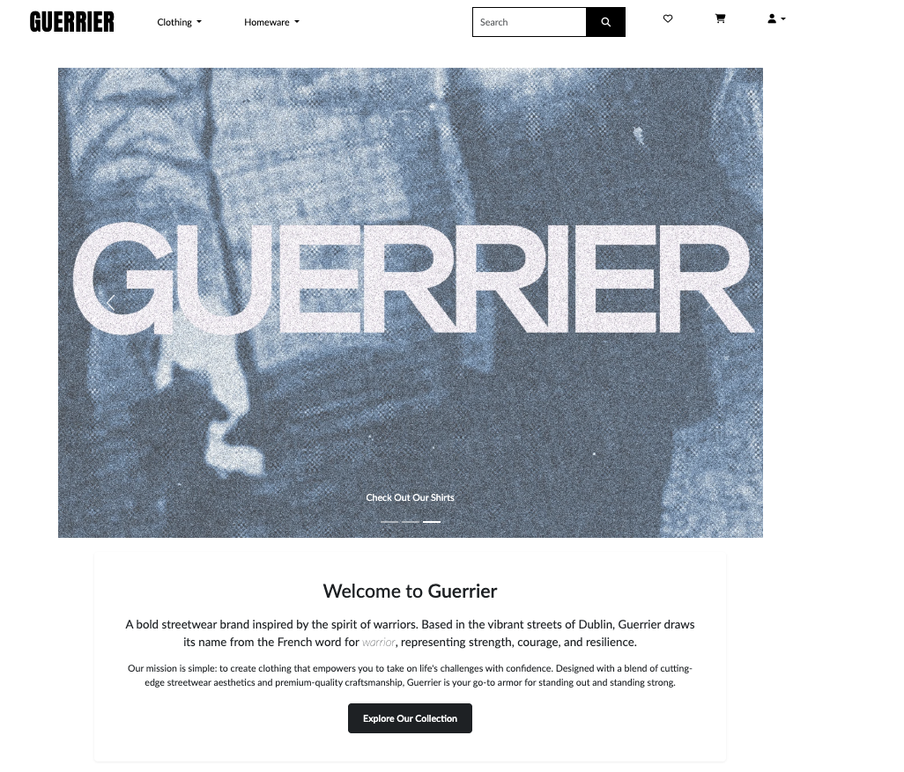

---

## Table of Contents

1. [UX](#ux)
2. [Strategy](#strategy)
   * [Target Users](#target-users)
   * [Site Goals](#site-goals)
   * [Project Goals](#project-goals)
3. [Agile Planning](#agile-planning)
   * [User Stories](#user-stories)
4. [Structure](#structure)
   * [Wireframes](#wireframes)
   * [Database Schema](#database-schema)
5. [Main Plan](#main-plan)
6. [Features](#features)
   * [Existing Features](#existing-features)
   * [Future Features](#future-features)
7. [Design](#design)
   * [Colour Scheme](#colour-scheme)
   * [Typography](#typography)
   * [Site Images](#site-images)
8. [Business Model](#business-model)
   * [Marketing Strategy](#marketing-strategy)
   * [SEO](#seo)
9. [Technologies](#technologies)
   * [Languages Used](#languages-used)
   * [Frameworks and Libraries](#frameworks-and-libraries)
   * [Tools and Resources](#tools-and-resources)
10. [Testing](#testing)
11. [Bugs](#bugs)
12. [Credits](#credits)
13. [Deployment](#deployment)
14. [Acknowledgements](#acknowledgements)

<br>

## UX

### Strategy

#### Target Users

- Fashion-conscious individuals aged 18-35
- Streetwear enthusiasts looking for unique designs
- Customers who value quality and brand story
- People who identify with the warrior mentality and resilience theme

#### Site Goals

- Create an intuitive shopping experience that showcases the Guerrier brand identity
- Allow users to easily browse, select, and purchase products
- Build brand loyalty through user accounts, wishlists, and reviews
- Provide secure checkout and payment processing
- Enable customers to contact the business with questions or feedback


#### Project Goals

- Develop a full-featured e-commerce platform using Django
- Implement responsive design for all device types
- Create a secure authentication system with user profiles
- Build a robust product management system for administrators
- Integrate Stripe for secure payment processing
- Implement SEO best practices for improved visibility

## Agile Planning

This project was developed using agile methodologies, breaking down the project into smaller tasks through user stories and tracking progress on GitHub Projects. 

### User Stories

#### First-Time Visitor Goals
- As a first-time visitor, I want to easily understand the brand's purpose and values
- As a first-time visitor, I want to browse products intuitively by category
- As a first-time visitor, I want to view product details and images clearly

#### Returning Visitor Goals
- As a returning visitor, I want to create an account to save my information
- As a returning visitor, I want to add items to my wishlist for future purchase
- As a returning visitor, I want to see my order history

#### Site Owner Goals
- As a site owner, I want to manage products through an admin interface
- As a site owner, I want to receive order notifications
- As a site owner, I want to promote special offers and new products

[Link to GitHub Projects Board](https://github.com/users/micdr93/projects/5)

# Structure

### Wireframes

I created detailed wireframes for both desktop and mobile versions of all main pages to guide the development process.

#### Desktop Wireframes

- [Home Page](documentation/wireframes/wireframe-home-page-desktop.png)
- [All Products Page](documentation/wireframes/wireframe-all-products-page-desktop.png)
- [Product Detail Page](documentation/wireframes/wireframe-product-detail-desktop.png)
- [Basket Page](documentation/wireframes/wireframe-basket-page-desktop.png)
- [Checkout Page](documentation/wireframes/wireframe-checkout-page-desktop.png)
- [Wishlist Page](documentation/wireframes/wireframe-wishlist-desktop.png)
- [Reviews Page](documentation/wireframes/wireframe-reviews-desktop.png)
- [Contact Us Page](documentation/wireframes/wireframe-contact-us-desktop.png)

#### Mobile Wireframes

- [Home Page](documentation/wireframes/wireframe-home-page-mobile.png)
- [All Products Page](documentation/wireframes/wireframe-all-products-page-mobile.png)
- [Product Detail Page](documentation/wireframes/wireframe-product-detail-mobile.png)
- [Basket Page](documentation/wireframes/wireframe-basket-page-mobile.png)
- [Checkout Page](documentation/wireframes/wireframe-checkout-page-mobile.png)
- [Wishlist Page](documentation/wireframes/wireframe-wishlist-mobile.png)
- [Reviews Page](documentation/wireframes/wireframe-reviews-mobile.png)
- [Contact Us Page](documentation/wireframes/wireframe-contact-us-mobile.png)

All wireframes were created using Balsamiq to establish a consistent user interface across the site while ensuring responsive design for different devices.

# Guerrier Clothing: Database Schema

## Overview

The Guerrier Clothing e-commerce platform utilizes a robust relational database architecture to manage products, user accounts, shopping interactions, and business operations. Our database design prioritizes data integrity, scalability, and performance to deliver a seamless shopping experience for our B2C customers.

## Core Models

### User Authentication & Profiles

#### User (Django's built-in User model)
- **id**: Primary key for user identification
- **username**: Unique username for login
- **email**: User's email address
- **password**: Encrypted password
- **first_name, last_name**: Personal information
- **is_active, is_staff, is_superuser**: Permission flags
- **date_joined, last_login**: Account timestamps

#### UserProfile
- **id**: Primary key
- **user**: One-to-One relationship with User model
- **full_name**: User's complete name
- **default_phone_number**: Contact information
- **default_street_address1, default_street_address2**: Shipping address
- **default_town_or_city**: City information
- **default_county**: County/state information
- **default_postcode**: Postal code
- **default_country**: Country (using django-countries)

### Product Management

#### Category
- **id**: Primary key
- **name**: Category identifier (e.g., "t-shirts", "hoodies")
- **friendly_name**: Human-readable name for display
- **description**: Detailed category description

#### Size
- **id**: Primary key
- **name**: Size identifier (e.g., "S", "M", "L", "XL")

#### Product
- **id**: Primary key
- **category**: Foreign key to Category
- **name**: Product name
- **description**: Detailed product description
- **price**: Retail price
- **discount_percent**: Applied discount (if any)
- **image**: Product image file
- **sku**: Stock Keeping Unit identifier
- **stock_qty**: Available inventory quantity
- **gender**: Target gender demographic
- **color**: Product color
- **sizes**: Many-to-Many relationship with Size model
- **rating**: Average product rating from reviews
- **featured, is_new, on_sale**: Product highlight flags
- **in_stock, is_active**: Availability indicators
- **created_at, updated_at, deleted_at**: Timestamp tracking

### Order Processing

#### Order
- **id**: Primary key
- **user_profile**: Foreign key to UserProfile (optional for guest checkout)
- **order_number**: Unique identifier for the order
- **full_name**: Customer name
- **email**: Contact email
- **phone_number**: Contact phone
- **country, county, postcode**: Shipping address details
- **town_or_city**: City for shipping
- **street_address1, street_address2**: Street address
- **date**: Order timestamp
- **delivery_cost**: Shipping cost
- **order_total**: Subtotal of all items
- **grand_total**: Final total including delivery
- **original_bag**: JSON snapshot of the cart
- **stripe_pid**: Payment processor identifier

#### OrderLineItem
- **id**: Primary key
- **order**: Foreign key to Order
- **product**: Foreign key to Product
- **product_size**: Selected size (if applicable)
- **quantity**: Number of items
- **lineitem_total**: Price × quantity

### Customer Engagement

#### Wishlist
- **id**: Primary key
- **user**: Foreign key to User
- **name**: Wishlist name
- **created_on, updated_on**: Timestamps
- **is_public**: Privacy setting

#### WishlistItem
- **id**: Primary key
- **wishlist**: Foreign key to Wishlist
- **product**: Foreign key to Product
- **added_on**: Timestamp
- **notes**: Customer notes
- **priority**: Customer-defined priority level

#### Review
- **id**: Primary key
- **product**: Foreign key to Product
- **user**: Foreign key to User
- **title**: Review title
- **review**: Review content
- **rating**: Numerical rating (1-5)
- **created_on, updated_on**: Timestamps
- **verified_purchase**: Purchase verification flag
- **helpful_votes**: Community endorsement counter

#### SuggestedItem (Recommendations)
- **id**: Primary key
- **product**: Foreign key to Product
- **suggestion_type**: Type of recommendation
- **weight**: Priority weighting
- **is_active**: Activation flag
- **created_on, updated_on**: Timestamps

### Marketing & Communication

#### NewsletterSubscription
- **id**: Primary key
- **email**: Subscriber email
- **date_added**: Subscription timestamp

#### Contact
- **id**: Primary key
- **name**: Contact name
- **email**: Contact email
- **subject**: Message subject
- **message**: Message content
- **date_submitted**: Submission timestamp

## Relationships

The database implements various relationship types to maintain data integrity:

1. **One-to-One**: 
   - User ↔ UserProfile

2. **One-to-Many**:
   - Category → Products
   - User → Orders
   - User → Wishlists
   - User → Reviews
   - Order → OrderLineItems
   - Wishlist → WishlistItems
   - Product → OrderLineItems
   - Product → WishlistItems
   - Product → Reviews
   - Product → SuggestedItems

3. **Many-to-Many**:
   - Products ↔ Sizes

## Database Optimization

- **Indexing**: Strategic indexes on frequently queried fields like `user`, `product`, and `order`
- **Cascade Delete**: Configured to maintain referential integrity when parent records are deleted
- **Null/Blank Constraints**: Applied appropriately to enforce data quality

## Data Security Considerations

- Personal information stored only when necessary for business operations
- Payment information handled securely through Stripe, not stored in database
- GDPR-compliant data handling with ability to delete user data on request

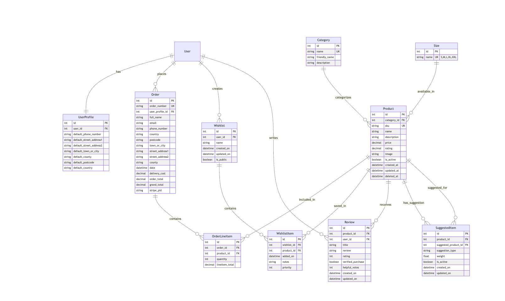

# Features
Guerrier's e-commerce platform combines aesthetic appeal with robust functionality to deliver a premium shopping experience aligned with our brand values. This section details the current features and planned enhancements.

## Current Features

#### Responsive Design System
The entire platform is built on a mobile-first approach, ensuring seamless experiences across all devices:
- Mobile optimization with touch-friendly elements
- Tablet-specific layouts maximizing screen real estate
- Desktop experience with enhanced visual presentations
- Consistent brand experience regardless of device

#### Navigation Bar
Our intuitive navigation bar provides quick access to all main sections of the site across all device sizes:
- Collapsible menu on mobile
- Full horizontal menu on desktop
- Quick access to cart, wishlist, and account features
- Search bar for site-wide product discovery


### Home Page
The home page serves as a powerful introduction to our brand with:
- Bold hero section with compelling call-to-action
- Featured product carousel highlighting new arrivals and 
- Newsletter signup form with instant validation
- Category shortcuts for easy browsing
- Promotional banners for current sales and events


#### Home Page Product Listings
- Curated selection of featured and new arrivals
- Visual indicators for sale items and limited editions
- Quick-add to cart functionality
- Responsive grid layout that adapts to all screen sizes
- Product sort options (newest, bestselling, price)

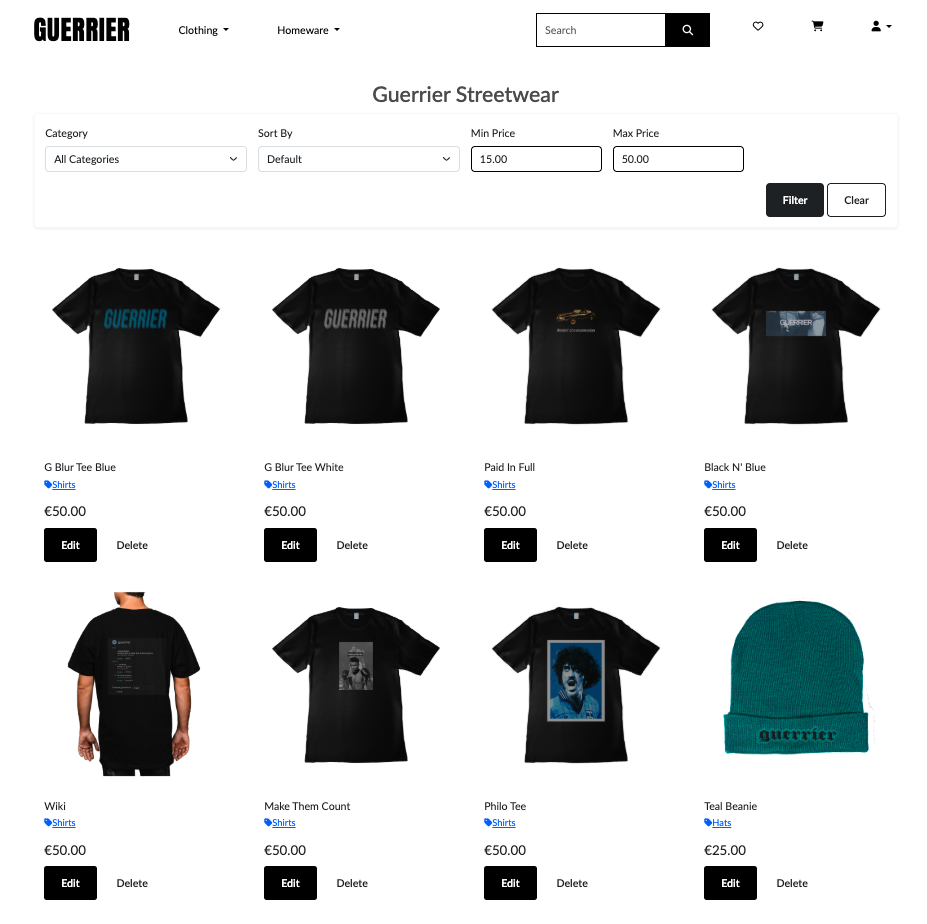

### Products Pages
The product pages offer robust browsing functionality:
- Filterable product listings by price
- Pagination for manageable browsing
- Detailed product cards with key information
- Quick-add to wishlist functionality

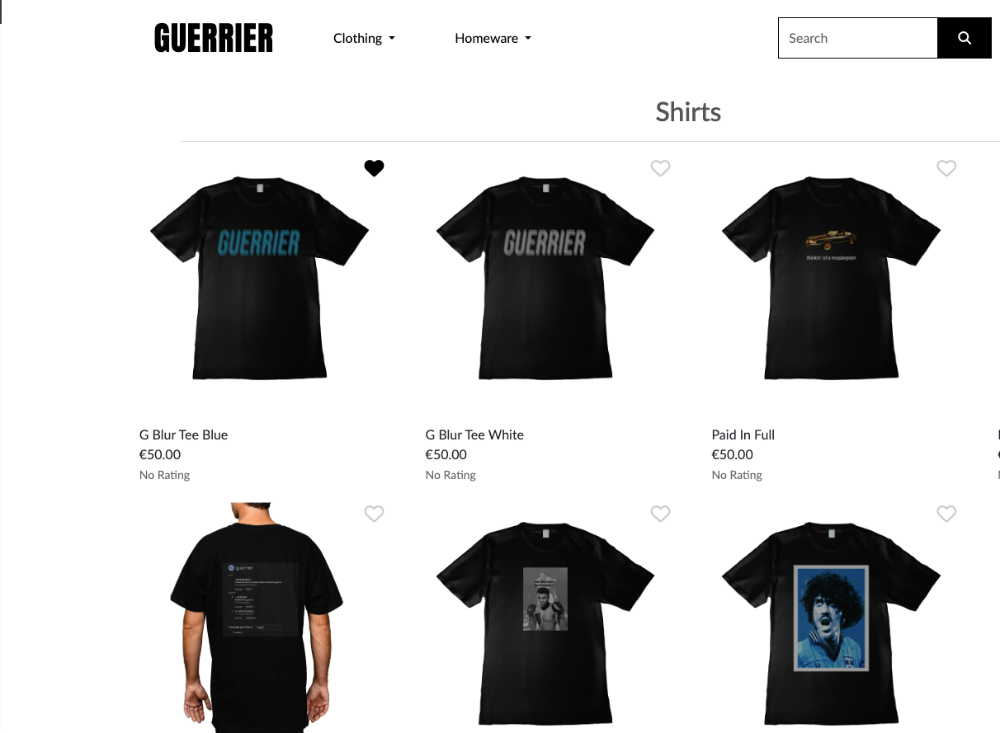

#### Product Detail

Each product detail page provides comprehensive information:
- High-quality product images 
- Complete product details 
- Size selection with availability indicators
- Related products section (see below)
- Customer reviews and ratings
- Add to cart with quantity selector

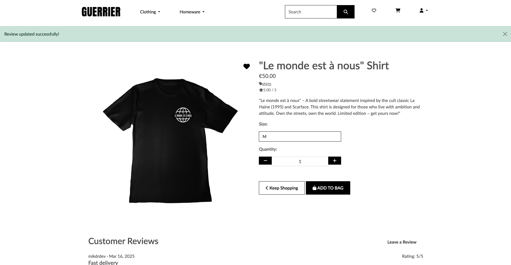

#### Related Products
On product detail pages, customers can discover similar items:
- Algorithmically generated product suggestions based on category, style, and purchase history
- Horizontal view for easy browisng
- Clear visual distinction from the main product


#### Search Results
When users search for products, they experience:
- Relevance-based result ordering
- Highlighted search terms in results
- Filter and sorting options specific to search results
- "No results found" page with popular suggestions
- Search history for logged-in users

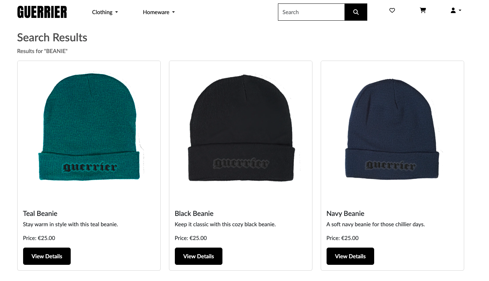

#### Shopping Cart
The shopping cart offers a streamlined experience:
- Real-time cart updates without page reloads
- Quantity adjustment with instant price recalculation
- Product image and details for easy identification
- "Continue shopping" and "Proceed to checkout" options
- Estimated shipping and tax calculations

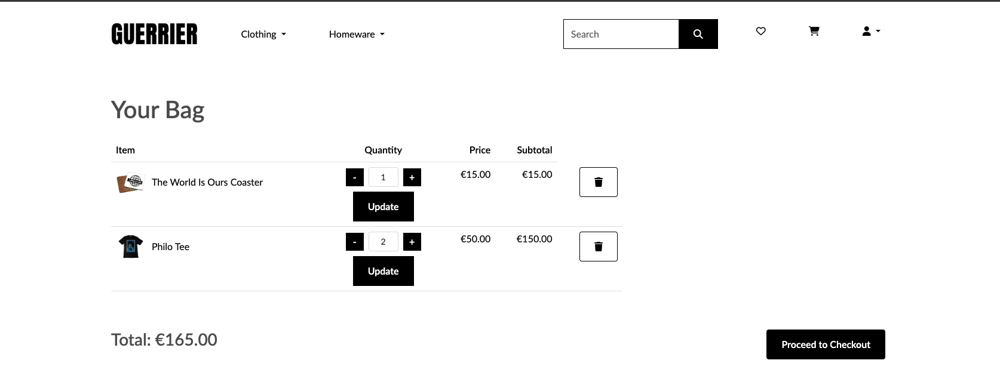

#### Checkout
Our secure checkout process includes:
- Guest checkout option with account creation prompt
- Saved delivery information for registered users
- Order summary with line-item breakdown
- Stripe integration for secure card payments
- Order confirmation with email notification


#### Footer 
The footer provides essential information and navigation:
- Links to important pages like contact, returns, and privacy policy
- Newsletter signup form for marketing communications
- Social media links to our brand channels
- Copyright and business information
- Quick links back to main home


#### User Account
Registered users benefit from personalized features:
- Dashboard with account overview
- Profile management with saved delivery information
- Order history 

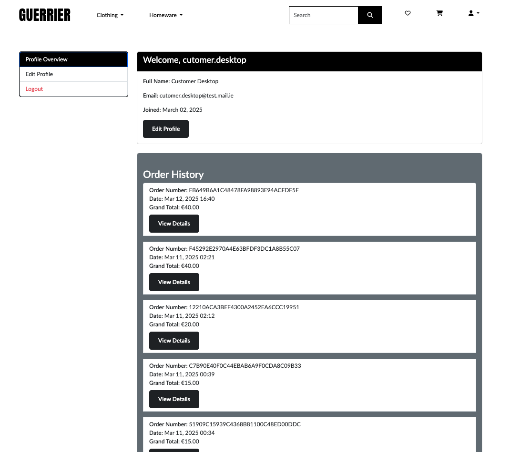

#### Suggested Items
Our recommendation engine enhances discovery:
- "Recommended for You" section based on browsing and purchase history
- Similar style suggestions within the same category
- "Customers Also Bought" recommendations from purchase patterns
- Recently viewed items for easy return shopping
- Personalized deal suggestions based on wishlist items


#### Reviews
The review system builds community trust:
- Star rating system from 1-5
- Verified purchase badges for authentic reviews
- Helpful vote system for community curation
- Photo upload option for customer product images
- Admin moderation to ensure quality content


#### Wishlist
The wishlist functionality enables future purchases:
- Easy transfer to shopping cart


#### Admin Product Management
Store administrators have powerful tools:
- Product dashboard with inventory alerts
- Image management with multiple uploads


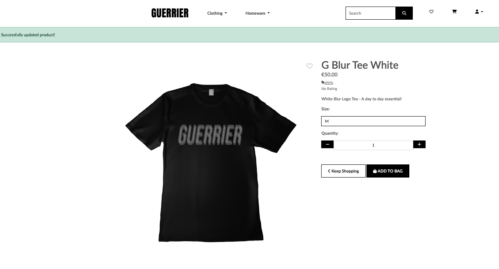

#### Admin Product Edit
The product editing interface offers comprehensive control:
- Image uploading
- SEO fields for meta descriptions and keywords
- Related product manual assignment

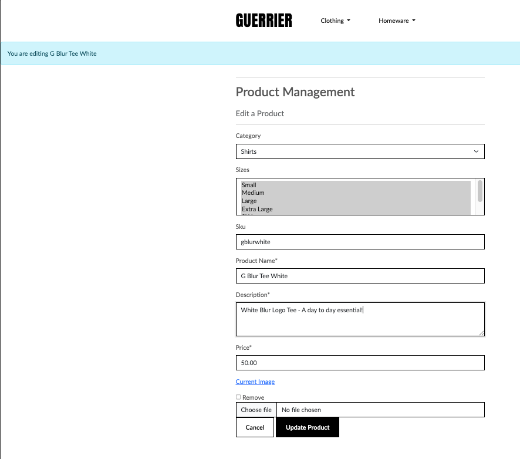

#### Admin All Products View
Administrators can manage the entire catalog efficiently:
- Sortable and filterable product table
- Quick edit functionality for key fields


#### Sign In/Create Account
Administrators can manage the entire catalog efficiently:
- Users can either login or sign up


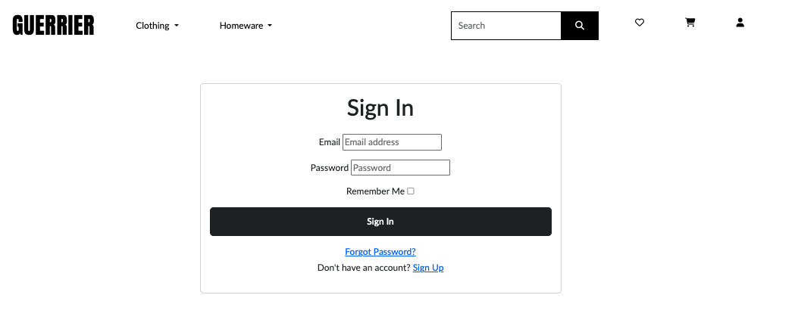


#### Dropdown 
Dropdown features:
- users can navigate easily with the dropwdown feature//


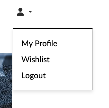
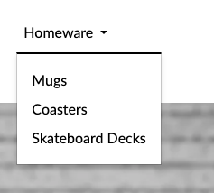

### Future Features

#### User Experience Enhancements
- Interactive icons: Color-changing icons for clearer user feedback (e.g., heart turns solid when item is in wishlist) - ADDED
- Product zoom: Enhanced zoom functionality on product images
- Size guide: Interactive size guide with measurements
- Live chat: Customer support through live chat integration


#### Technical Integrations
- MailChimp integration for advanced email marketing
- Enhanced payment options (Apple Pay, Google Pay, etc.)
- Social media shopping integration
- Advanced product recommendation engine
- Mobile app development for iOS and Android

## Design

### Colour Scheme

The color palette was chosen to reflect the brand's bold and urban aesthetic while ensuring accessibility and readability throughout the site.

- Primary: #1A1A1A (Dark Gray/Black) - Used for text and to create contrast
- Secondary: #FFFFFF - Used for text on dark backgrounds and for background for a clean look
- Accent: #555555 (Dark Gray/Black) - Used on buttons and certain areas of text to 

### Typography

The site uses a combination of bold display fonts for headings and clean, modern sans-serif fonts for body text, creating a clear hierarchy and consistent readability across devices.

### **Fonts Used**

| Font Name | Purpose                        | Source |
|:------------|:--------------------------------|:-------------|
| **Anton**      | Logo branding, headings, and footer titles | [Google Fonts - Anton](https://fonts.google.com/specimen/Anton) |
| **Lato**       | Body text and general site content            | [Google Fonts - Lato](https://fonts.google.com/specimen/Lato) |
| **Roboto**     | Available for additional headings or future content areas | [Google Fonts - Roboto](https://fonts.google.com/specimen/Roboto) |

---

### **Font Sizes & Weight**

- **Navbar Brand / Logo**:  
  - Font: `Anton`  
  - Size: `2.5rem`  
  - Weight: `normal`  
  - Text Transform: `uppercase`  
  - Letter Spacing: `1px`

- **Hero Banner Text**:  
  - Font Size: `2rem` (`1.5rem` on screens < 576px)  
  - Color: `#fff`  

- **Button Text**:  
  - Font Size: `1rem`  
  - Font Weight: `600`  
  - `.btn-sm-custom`: `0.8rem`  

- **Bold Text Utility Class**:  
  - Class: `.bold-text`  
  - Weight: `900`

---

### **Text Colors**

- **Primary Text Color**: `#555`
- **Navbar & Dropdown Items**: `#000`  
- **Footer Link Hover**: `#333`
- **Button Hover Text**: `#fff`

---

### **Letter Spacing & Text Transform**

- **Navbar Brand & Footer Headings**:  
  - Letter Spacing: `1px`  
  - Text Transform: `uppercase`  

---

### **Utilities**

- **Wishlist Icon Button**:  
  - Font Size: `1.5rem`  
  - Color: `#ccc` (default), `black` (active)

### Images

- All images and products on the site were created by myself, using Adobe Photoshop.

# Business Model

Guerrier Clothing operates on a Business-to-Consumer (B2C) e-commerce model, selling premium streetwear directly to our target audience without intermediaries. Our business strategy focuses on building brand loyalty through quality products, compelling storytelling, and an exceptional online shopping experience.

## Value Proposition

Guerrier offers a unique value proposition in the crowded streetwear market:

- **Warrior-Inspired Design Philosophy**: Each piece tells a story of strength and resilience, connecting with customers on an emotional level beyond typical streetwear aesthetics.
- **Premium Quality Materials**: Our products use high-quality fabrics and construction techniques that justify the price point and ensure durability.
- **Limited Edition Releases**: We create scarcity through limited production runs, enhancing desirability and exclusivity.
- **Urban Dublin Heritage**: Drawing inspiration from Dublin's vibrant street culture gives our brand authentic roots and a distinct perspective.
- **Community Connection**: We're building more than a clothing brand—we're creating a community of like-minded individuals who identify with the warrior mentality.

## Target Market Analysis

Our primary demographic consists of fashion-conscious individuals aged 18-35, but can be further segmented into:

| Segment | Characteristics | Purchasing Behavior | Marketing Approach |
|---------|----------------|---------------------|-------------------|
| Urban Trendsetters (22-28) | Early adopters, social media savvy, value uniqueness | Higher purchase frequency, willing to pay premium for exclusive items | Instagram showcases, influencer collaborations, limited drops |
| Lifestyle Enthusiasts (25-35) | Career-focused, value quality and versatility | Fewer but larger purchases, brand loyal | Quality-focused content, loyalty rewards, styling suggestions |
| Streetwear Collectors (18-30) | Highly knowledgeable about streetwear culture, see clothing as investment | Highly selective, focused on limited editions | Behind-the-scenes content, early access, collector's editions |
| Fitness Community (20-35) | Fitness-focused, appreciate performance and aesthetics | Value durability and comfort alongside style | Performance aspects, athlete ambassadors, active lifestyle content |

## Revenue Model

Our pricing strategy balances premium positioning with competitive market rates, as evidenced by our current product catalog:

- **Product Pricing Structure**: 
  - T-shirts: €50 (Premium streetwear basics with urban designs)
  - Headwear: €25 (Beanies and caps)
  - Skate Decks: €40 (Urban lifestyle accessories)
  - Mugs: €20 (Branded home goods)
  - Coasters & Small Items: €15 (Entry-level branded merchandise)


# Marketing Strategy

Guerrier's marketing strategy is designed to establish our brand as a premium streetwear label that resonates with our target audience's values of strength, resilience, and urban authenticity. Our approach combines digital engagement, content marketing, community building, and strategic partnerships to create a cohesive brand experience.

## Brand Positioning

Guerrier is positioned as a premium streetwear brand with an authentic warrior ethos, appealing to urban fashion enthusiasts who value quality, distinctive design, and meaningful brand stories. Our positioning statement:

> "For the urban fashion enthusiast who seeks clothing that represents inner strength, Guerrier offers premium streetwear that combines bold aesthetics with quality craftsmanship, inspired by the warrior spirit. Unlike mainstream streetwear brands, Guerrier embodies resilience and authenticity through limited-edition pieces that tell a story."

### Social Media Strategy

#### Facebook Marketing Page Strategy

Our Facebook page ([Guerrier Clothing](https://www.facebook.com/people/Guerrier/61572317841699/)) serves as a central hub for community engagement and brand awareness:


### Email Marketing & Newsletter

Our newsletter is a cornerstone of our direct customer communication strategy, accessible through sign-up forms in our website footer and pop-ups on the home page for visitors.

### SEO

- Keyword research focused on streetwear, Dublin fashion, and urban clothing
- Optimized meta tags and descriptions
- Custom robots.txt and sitemap.xml files
- Optimized site loading speed

# Technologies

## Languages Used
* [HTML5](https://en.wikipedia.org/wiki/HTML5)
* [CSS3](https://en.wikipedia.org/wiki/Cascading_Style_Sheets)
* [Javascript](https://en.wikipedia.org/wiki/JavaScript)
* [Python](https://en.wikipedia.org/wiki/Python_(programming_language))

## Frameworks Used

* [Django](https://www.djangoproject.com/) - Python web framework used as the main architecture
* [Bootstrap](https://blog.getbootstrap.com/) - Frontend framework for responsive design
* [jQuery](https://jquery.com/) - JavaScript library for DOM manipulation
* [Font Awesome](https://fontawesome.com/) - Icon library used throughout the site


## Libraries And Installed Packages

* [crispy-bootstrap4](https://pypi.org/project/crispy-bootstrap4/) - Template pack used for django-crispy-forms
* [django-crispy-forms](https://pypi.org/project/crispy-bootstrap4/) - Used to render forms throughout the project
* [dj-database-url](https://pypi.org/project/dj-database-url/) - A package used to utilize DATABASE_URL environment variable  
* [django-allauth](https://django-allauth.readthedocs.io/en/latest/) - Allows authentication, registration and account management
* [django-countries, v7.2.1](https://pypi.org/project/django-countries/7.2.1/) - Django application for country choices in forms and models
* [gunicorn](https://gunicorn.org/) - A Python WSGI HTTP Server for UNIX
* [psycopg2](https://pypi.org/project/psycopg2/) - A PostgreSQL database adapter
* [django storages](https://django-storages.readthedocs.io/en/latest/) - Collection of custom storage backends for Django
* [stripe==7.8.1](https://pypi.org/project/stripe/) - A Python library for Stripe's API
* [django-summernote](https://github.com/summernote/django-summernote) - WYSIWYG editor for Django admin
* [Pillow](https://pypi.org/project/Pillow/) - Python Imaging Library for image processing
* [django-axes](https://django-axes.readthedocs.io/en/latest/) — For login attempt monitoring and brute-force attack prevention.
* [Cloudinary](https://cloudinary.com/documentation/django_integration) — For media and image management in the cloud.


## Tools And Resources

* [GitPod](https://www.gitpod.io/) - Initially used as a coding environment.
* [VSCode](https://code.visualstudio.com/) - Used as a coding environment.
* [GitHub](https://github.com/) - Used for creating application repository, version control, organising workflow utilising agile functionality of GitHub project, issues and milestones.
* [Heroku](https://heroku.com) - Used to deploy live project.
* [PostgreSQL CI Database](https://dbs.ci-dbs.net/) - Used to create a database
* [JSHint](https://jshint.com/) - Used to validate JavaScript.
* [W3C Markup Validation Service](https://validator.w3.org/) - Used to validate HTML.
* [CSS Validation Service](https://jigsaw.w3.org/css-validator/) - Used to validate CSS.
* [CI Python Linter](https://pep8ci.herokuapp.com/#) - Used to validate Python.
* [Conventional Commits](https://www.conventionalcommits.org/) - Used to improve commit messaging
* [Dillinger](https://dillinger.io/) - Used for markup preview
* [OneCompiler](https://onecompiler.com/) - Used for testing and previewing code
* [Adobe Suite](https://www.adobe.com/) - Used for creating product images.
* [Mermaid Live Editor](https://mermaid.live/edit) - Used for creating the ERD using Mermaid, a JavaScript based diagramming and charting tool

# Testing

For all testing, please refer to the [TESTING.md](TESTING.md) file.


# Bugs

### Fixed Issues

- **Remove Item from Bag Bug**  
  Initially, users were unable to remove items from the shopping bag correctly. This was identified and resolved to ensure smooth removal and instant bag updates.  
    

---

### Integration and Development Challenges

- **Stripe Payment Integration**  
  The Stripe integration took longer than expected due to configuration issues with the webhook URL and difficulties getting the card field to display properly. These were resolved after careful troubleshooting and testing, resulting in a stable payment flow.

- **Project Environment Reset and Codebase Management**  
  The project experienced an environment failure that required rebuilding the virtual environment and reverting to earlier commits to recover functionality. While this affected the development timeline, it allowed for a clean and stable setup moving forward.

---

### Notes

- Sensitive Stripe communications and API details are excluded to maintain security.  
- All fixes and updates have been tested across browsers and devices to ensure consistent user experience.


# Credits
## Listed below are sources of information which helped me in the making of this project
- [Boutique Ado Walkthrough Project](https://learn.codeinstitute.net/courses/course-v1:CodeInstitute+EA101+2021_T1/courseware/eb05f06e62c64ac89823cc956fcd8191/3adff2bf4a78469db72c5330b1afa836/)
- [I Think Therefore I Blog Walkthrough Project](https://learn.codeinstitute.net/courses/course-v1:CodeInstitute+FSD101_WTS+2023_Q3/courseware/56a2da0940b4411d8a38c2b093a22c60/4565659a34d648b8b8edd063c3182180/)
- [Performance Footwear](https://github.com/Marchopkins96/Performance-Footwear/tree/main)
(I used the carousel feature from this repo along with readme and testing files as boileplates)

### Deployment 

The live deployed application can be found deployed on [Heroku] (https://guerrier-184e74af35e6.herokuapp.com/)


### Heroku Deployment

This project uses [Heroku](https://www.heroku.com), a platform as a service (PaaS) that enables developers to build, run, and operate applications entirely in the cloud.


#### Cloning

You can clone the repository by following these steps:

1. Go to the [GitHub repository](https://github.com/micdr93/Guerrier-Clothing)
2. Locate the Code button above the list of files and click it
3. Select if you prefer to clone using HTTPS, SSH, or GitHub CLI and click the copy button to copy the URL to your clipboard
4. Open Git Bash or Terminal
5. Change the current working directory to the one where you want the cloned directory
6. In your IDE Terminal, type the following command to clone the repository:
    - `git clone https://github.com/micdr93/Guerrier-Clothing.git`
7. Press Enter to create your local clone.

#### Forking

By forking the GitHub Repository, we make a copy of the original repository on our GitHub account to view and/or make changes without affecting the original owner's repository.  
You can fork this repository by using the following steps:

1. Log in to GitHub and locate the [GitHub Repository](https://github.com/micdr93/Guerrier-Clothing)
2. At the top of the Repository (not top of page), just above the "Settings" Button on the menu, locate the "Fork" Button.
3. Once clicked, you should now have a copy of the original repository in your own GitHub account!


## Local Development Setup

### Requirements
- Python 3.8+
- Git
- PostgreSQL (recommended)

### Steps
1. Clone the repository:
```bash
git clone https://github.com/micdr93/Guerrier-Clothing.git
```

2. Navigate to the project directory:
```bash
cd Guerrier-Clothing
```

3. Create and activate a virtual environment:
```bash
python -m venv .venv
source .venv/bin/activate # On Windows use `.venv\Scriptsctivate`
```

4. Install dependencies:
```bash
pip install -r requirements.txt
```

5. Configure environment variables by creating a `.env` file:
```bash
SECRET_KEY='your-secret-key'
DEBUG=True
DATABASE_URL='your-database-url'
STRIPE_PUBLIC_KEY='your-stripe-public-key'
STRIPE_SECRET_KEY='your-stripe-secret-key'
```

6. Set up the database:
```bash
python manage.py migrate
```

7. Load initial data (optional):
```bash
python manage.py loaddata fixtures.json
```

8. Run the development server:
```bash
python manage.py runserver
```

9. Access the site locally at `http://localhost:8000`.

---


# Acknowledgements 

* I would like to thank my Mentor, Daniel Hamilton for his help and guidance so far on all projects.
* I would also like to express my thanks to the Code Institute tutors and Student Care team who have supported me so far.
